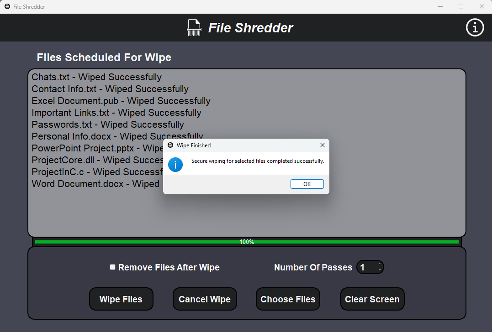
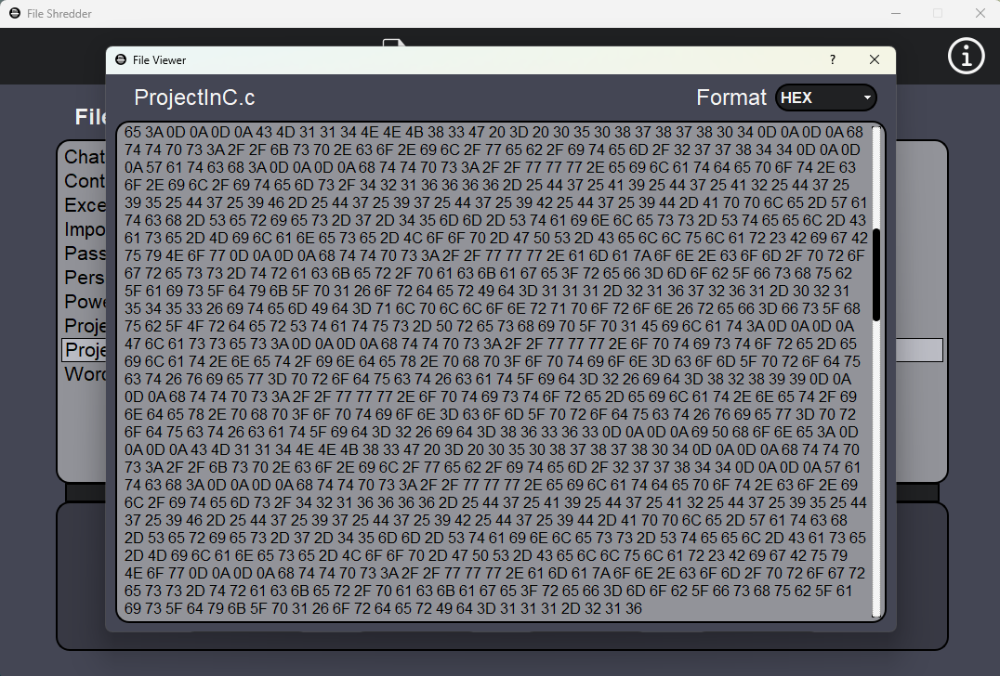

# File Shredder App

The File Shredder App is a powerful tool designed to securely erase files, making data recovery virtually impossible. This application utilizes multiple passes and employs the Mersenne Twister random number generator to overwrite file contents with secure and random bytes. Developed in C++ with Qt framework, it features multi-threading for wiping multiple files and smart memory management for efficiency.

## Clone Repository:

```shell
git clone https://github.com/Shayhha/FileShredder
```

## Features

- **Multiple Passes**: The File Shredder allows you to perform multiple passes to ensure that files are thoroughly overwritten, making data recovery extremely challenging.

- **Mersenne Twister RNG**: The File Shredder uses the Mersenne Twister random number generator for generating secure and unpredictable bytes during the file wiping process.

- **User-Friendly GUI**: With a modern and intuitive graphical user interface built using Qt, the File Shredder is easy to use, even for those new to data shredding.

## Usage

1. Run FileShredder.exe file in x64/Release folder (for 64-bit Windows machines).
2. Select the files you want to securely erase.
3. Configure the number of passes you wish to perform (more passes mean greater security).
4. Click the "Wipe Files" button to initiate the file shredding process.

## Screenshots


*Wiping Files*


*Finished Wiping*

## Requirements

- Qt Framework: Please ensure that you have Qt version 15.5.2 or a later installed on your system in order to build and run this application (pre compiled version for 64-bit Windows is available in x64/Release folder).

## How to Build

1. Clone this repository to your local machine.
2. Open the project in your preferred Qt development environment (Visual Studio with Qt Tools extension is recommended).
3. Build and compile the project.
4. Run the application.

## License

This File Shredder is released under the [MIT License](LICENSE).

© All rights reserved to Shayhha (Shay Hahiashvili).
