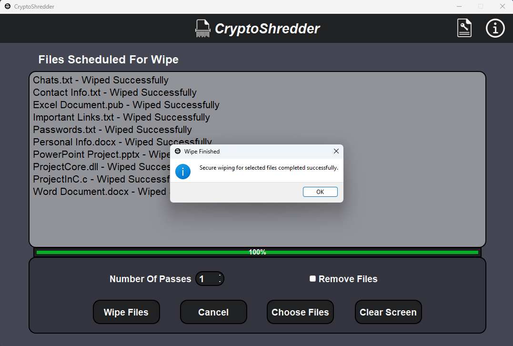
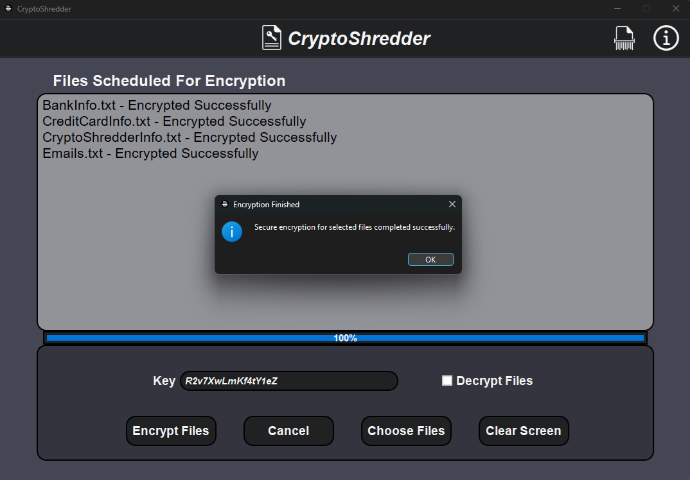
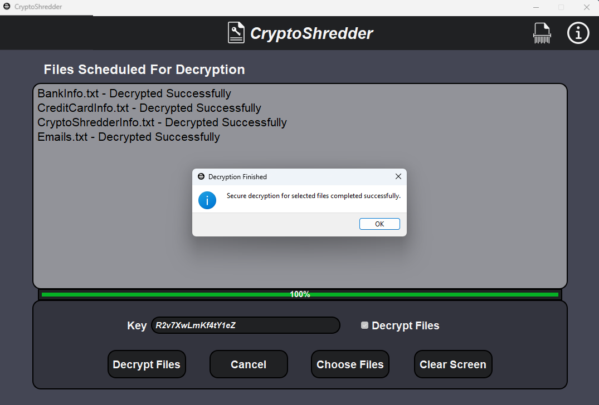
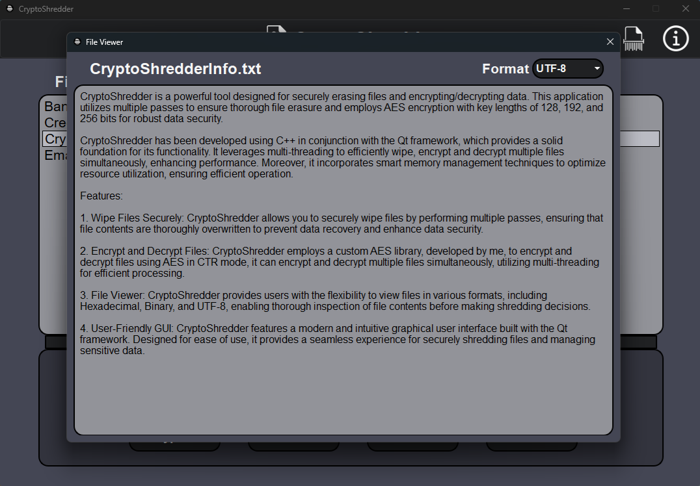

# CryptoShredder - Secure File Management Utility

CryptoShredder is a powerful tool designed to securely erase files, making data recovery virtually impossible. Additionally, it offers the capability to encrypt and decrypt files using AES-128, AES-192, and AES-256. This tool has been developed using C++ in conjunction with the Qt framework, which provides a solid foundation for its functionality. It leverages multi-threading to efficiently wipe, encrypt and decrypt multiple files simultaneously, enhancing performance. Moreover, it incorporates smart memory management techniques to optimize resource utilization, ensuring efficient operation.

## Clone Repository:

```shell
git clone https://github.com/Shayhha/CryptoShredder
```

## Features

- **Multiple Passes**: CryptoShredder allows you to perform multiple passes while wiping to ensure that files are thoroughly overwritten, making data recovery virtually impossible.

- **AES Encryption/Decryption**: CryptoShredder employs a custom AES library, developed by me, to encrypt and decrypt files using the AES algorithm in CTR mode, ensuring a fast and reliable process.

- **File Viewer**: CryptoShredder provides users with the flexibility to view files in various formats, including Hexadecimal, Binary, and UTF-8, enabling thorough inspection of file contents before processing them.

- **User-Friendly GUI**: With a modern and intuitive graphical user interface constructed with Qt, CryptoShredder is not only easy to use but also comprehensive in its features.

## Usage

1. Run CryptoShredder.exe file in x64/Release folder (for 64-bit Windows machines).
2. Select the mode of operation, wipe or encrypt/decrypt files.
3. Select the files you want to wipe or encrypt/decrypt.
4. For wiping, you can configure the number of passes you want to execute. When it comes to encrypting or decrypting, simply provide the required key for the operation.
5. For wiping, click "Wipe Files" button to initiate the file shredding process. For encryption or decryption click "Encrypt Files" or "Decrypt Files" button to process the operation.

## Screenshots


*Wiping Files*


*Encrypting Files*


*Decrypting Files*


*Viewing File*

## Requirements

- Qt Framework: Please ensure that you have Qt version 15.5.2 or later installed on your system in order to build and run this application (pre compiled version for 64-bit Windows is available in x64/Release folder).

## How to Build

1. Clone this repository to your local machine.
2. Open the project in your preferred Qt development environment (Visual Studio with Qt Tools extension is recommended).
3. Build and compile the project.
4. Run the application.

## Contact

For questions or feedback, please contact [shayhha@gmail.com](mailto:shayhha@gmail.com).

## License

CryptoShredder makes use of custom [AES library](https://github.com/Shayhha/AES), all rights reserved to library's creator.

CryptoShredder is released under the [MIT License](LICENSE.txt).

© All rights reserved to Shayhha (Shay Hahiashvili).
