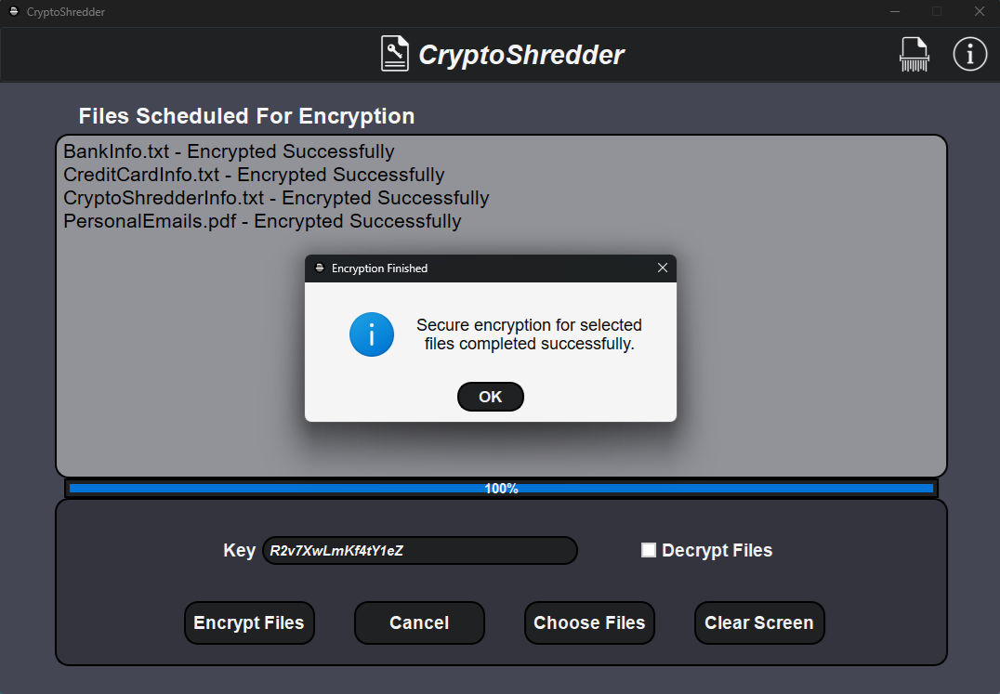
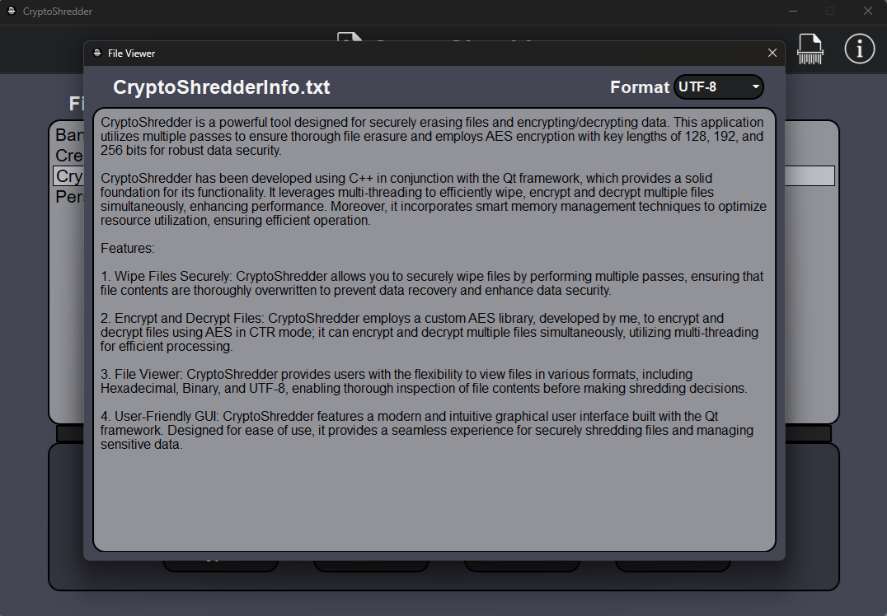

# CryptoShredder - Secure File Management Utility

CryptoShredder is a powerful tool designed for securely erasing files and encrypting/decrypting data. This application utilizes multiple passes to ensure thorough file erasure and employs AES encryption with key lengths of 128, 192, and 256 bits for robust data security. 

CryptoShredder has been developed using C++ in conjunction with the Qt framework, which provides a solid foundation for its functionality. It leverages multi-threading to efficiently wipe, encrypt and decrypt multiple files simultaneously, enhancing performance. Moreover, it incorporates smart memory management techniques to optimize resource utilization, ensuring efficient operation.

## Clone Repository:

```shell
git clone https://github.com/Shayhha/CryptoShredder
```

## Features

- **Wipe Files Securely**: CryptoShredder allows you to securely wipe files by performing multiple passes, ensuring that file contents are thoroughly overwritten to prevent data recovery and enhance data security.

- **Encrypt and Decrypt Files**: CryptoShredder employs a custom AES library, developed by me, to encrypt and decrypt files using AES in CTR mode, it can encrypt and decrypt multiple files simultaneously, utilizing multi-threading for efficient processing.

- **File Viewer**: CryptoShredder provides users with the flexibility to view files in various formats, including Hexadecimal, Binary, and UTF-8, enabling thorough inspection of file contents before making shredding decisions.

- **User-Friendly GUI**: CryptoShredder features a modern and intuitive graphical user interface built with the Qt framework. Designed for ease of use, it provides a seamless experience for securely shredding files and managing sensitive data.

## Usage

1. Run CryptoShredder.exe file in x64/Release folder (for 64-bit Windows machines).
2. Select the files you want to securely erase or encrypt/decrypt.
3. Configure the number of passes you wish to perform for secure file wiping or enter key for encryption/decryption.
4. Click the appropriate action button ("Wipe Files" or "Encrypt/Decrypt Files") to initiate the process.


## Screenshots


*Wiping Files*


*Encrypting Files*


*Decrypting Files*


*Viewing File*

## Requirements

- Qt Framework: Please ensure that you have Qt 6.9.0 or later installed on your system in order to build and run this application (pre compiled version for 64-bit Windows is available in x64/Release folder).

## How to Build

1. Clone this repository to your local machine.
2. Open the project in your preferred Qt development environment (Visual Studio with Qt Tools extension is recommended).
3. Build and compile the project.
4. Run the application.

## Contact

For questions or feedback, please contact [shayhha@gmail.com](mailto:shayhha@gmail.com).

## License

CryptoShredder makes use of a custom [AES library](https://github.com/Shayhha/AES), all rights reserved to library's creator.

CryptoShredder is released under the [MIT License](LICENSE.txt).

© All rights reserved to Shayhha (Shay Hahiashvili).
